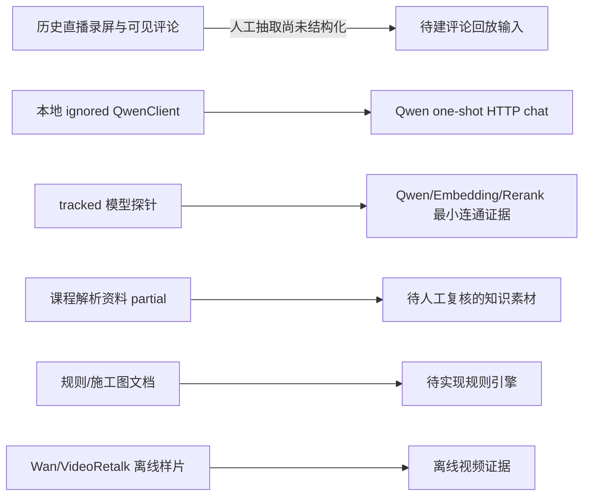
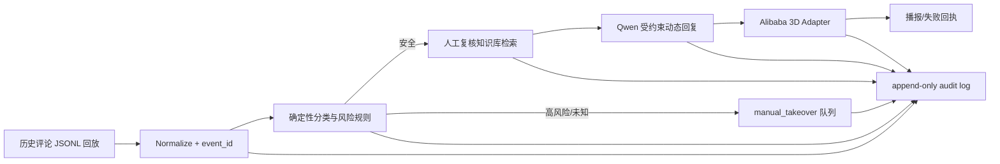

# V0 直播大脑架构与完成度

## 当前真实架构

当前没有形成 `评论输入 → 分类 → 知识/规则 → 动态回复 → 风险/转人工 → 阿里 3D 数字人播报 → 日志` 的可执行连线。

## 模块完成度

| 模块 | 当前事实 | 状态 | 证据 |
|---|---|---|---|
| 评论采集/回放 | 历史录屏有评论；无标准化输入文件或执行入口 | FAIL | `最新直播/`、`03_直播录屏与评论证据审计.md` |
| 意图分类 | 有规则/施工图描述；无可执行分类器 | FAIL | `local_only_reports/`、`项目资料_docs/` |
| 知识库素材 | 课程资料已导入，含 transcript/QA/action；复核清单仍为 partial | PARTIAL | `项目资料_docs/课程解析资料_course_analysis/` |
| 知识检索 | 模型探针证明 embedding/rerank 最小连接；无 V0 index/readback | FAIL | `outputs/probe_runs/20260623_224738_*/` |
| 动态文本生成 | `src/live_brain/qwen_client.py` 支持 one-shot chat；历史 Qwen 输出一次成功 | PARTIAL | `src/live_brain/qwen_client.py`、`outputs/qwen_runs/20260608_171300_*/` |
| 业务规则 | 分类/回复/异议/促销/禁限/接管有文档候选；未运行 | PARTIAL | `项目资料_docs/`、`local_only_reports/` |
| 风险与转人工 | 文档层有边界；无状态机、队列和人工接管事件 | FAIL | repo-wide code audit |
| 阿里 3D 表现层 | 有 Wan/VideoRetalk 离线视频能力证据；无实时 3D 动态播报适配器 | FAIL | `codex_reports/`、`outputs/` |
| TTS/播报 | 未发现可确认实现和回执 | FAIL | repo-wide code audit |
| 全链路日志 | 探针有 run report；无评论事件级 audit log | FAIL | `outputs/probe_runs/` |
| 启动入口 | `scripts/run_live_demo.py` 是 placeholder | FAIL | `scripts/run_live_demo.py` |
| 测试 | 本地 7 个 mock/config tests 通过，不覆盖 V0 | PARTIAL | `tests/`、`06_V0运行测试报告.md` |

## 已确认技术底座

- Qwen 文本 API one-shot 调用代码和历史成功输出。
- Alibaba 模型 registry 与多模型最小探针。
- 课程解析资料可作为知识候选源。
- 历史真实直播录屏可作为受控回放输入源。
- Wan/VideoRetalk 离线样片可作为视觉方向和离线能力证据。

## 不能外推的结论

- 模型连通 ≠ V0 链路完成。
- embedding/rerank 探针连通 ≠ 知识库已索引、可回读。
- 离线 15/30 秒视频 ≠ 阿里 3D 数字人实时动态播报。
- mock tests 通过 ≠ 评论/知识/规则/转人工/播报集成通过。
- 录屏可见评论 ≠ AI 已读取或回答评论。

## V0 建议目标架构

V0 只需受控回放和客户现场可见闭环；真实平台评论 API、OBS/RTMP、20–30 分钟连跑和自动剪辑属于后续阶段，除非合同书面变更。
